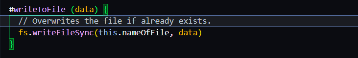
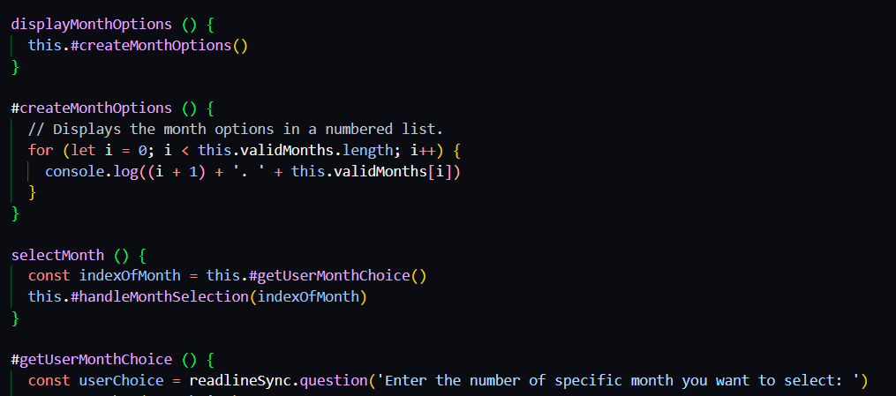
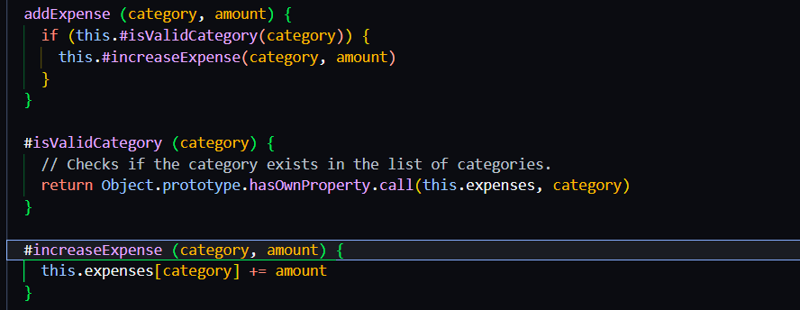

# Reflektion kring Clean Codes påverkan på appen och modulen

## Kap 2
Namngivning och de principer som boken tar upp kring området, är kanske det som påverkat min kod mest av allt. Min utgångspunkt har hela tiden varit att välja så beskrivande namn som möjligt. Vilket jag också nu inser hjälper en att både förstå koden och inte tvingas skriva överflödiga kommentarer. Ibland kan jag tycka att namnen blir onödigt långa och att jag möjligen bryter mot principer som "Don't Add Gratuitous Context" i mitt försök att skapa så beskrivande namn som möjligt. Detta kan dels bero på språkbrister men jag tror också min inställning beskrivande namn har högst prioritet påverkar detta.

 

 ## Kap 3
 "Do One Thing" som tas upp i kapitlet har influerat koden till stor del. Även om jag ser värdet i det gällande läsbarhet, förståelse och underhållbarhet med mera så tycker jag det är svårt att implementera och ibland gör koden mindre tydlig. Jag kan tycka att det kan vara bra att ha privata hjälpmetoder som gör en sak men som samlas som i en mittpunkt i en publik metod som sedan används. För mig är det ett strukturerat sätt som är lätt att förstå och klasserna blir inte lika långa som om exakt allt bryts ut till att göra en sak väldigt strikt. Jag vet inte riktigt hur synen på det här kopplat till clean code i allmänhet är. Huruvida en publik "uppsamlingsmetod" som använder flera privata hjälpfunktioner följer "Do One Thing" är förmodligen diskutabelt. En annan aspekt från kapitlet som jag haft funderingar kring tidigare och som jag ser som endast postiv är "The Stepdown Rule". Tidigare har det varit lite oklart hur man egentligen bör sortera kod, där privata eller för den delen publika hjälpmetoder förekommer. Nu har jag sorterat det så publik följs av de relevanta hjälpmetoderna vilket skapar struktur.

 Nedan följer bild som visar på en publik "samlingsmetod" som möjligen bryter mot "Do One Thing" och följer "The Stepdown Rule"

 

 ## Kap 4
 Att inte skriva onödiga eller överflödiga kommentarer har varit både ovant och svårt. Jag tycker en positiv aspekt är att man tvingas skapa beskrivande namn och hålla metoder och så vidare korta så att de är lätta att förstå, då man inte kan förlita sig på kommentarerna. Dock tycker jag om strukturen när man använder kommentarer till alla metoder och anger parametrar och returns och så vidare. Kanske för att det är så jag är van att läsa och skriva kod, men jag kan också tycka att övertydlighet är till godo när man är nybörjare inom området. Min utgångspunkt i det här projektet att skriva så få kommentarer som möjligt och egentligen bara där jag tycker det kan vara på sin plats att förtydliga något. På så vis har jag undvikit "Redundant comments", "Bad Comments" eller onödiga/dåliga kommentarer överhuvudtaget.

 

 ## Kap 5
Formattering har variet en naturlig del i kodningen genom hela utbildningen i och med de lint anvisningar vi fått och rättat oss efter. Därför har jag inte direkt tänkt på vertikal eller horisontell sortering mer än tidigare på grund av Clean Code. Den större saken jag tagit med mig och tänkt på är "Conceptual Affinity". Även om man följer "StepDown Rule" eller liknande kan det ibland uppstå frågetecken kring var kod ska placeras. Exempelvis vilken publik metod som ska komma under de privata hjälpmetoderna till en annan metod. Jag har nu lärt mig och utgått ifrån att placera den metod som är mest relaterad till den första så närsa som mmöjligt. Om jag blir osäker försöker se det lite som styckindelning i en text, där man ju vill ha relaterade saker nära.

Bild visar hur jag försöker uppnå "Conceptual Affinity" genom att ha relaterade metoder nära. Logik för visa månader och att välja månad är i min tanke starkt förknippade med varandra i kodens flöde.

## Kap 6
Det här är väl att av de i mina ögon svårare kapitlen att implementera och jag tycker i ärlighetens namn att sådana här mer teknikspecifika riktlinjer är svåra att följa och uppfylla. Förmodligen för att jag inte helt förstår det. Jag misstänker också att detta kapitels principer är lättare att implementera i ett språk som Java som är mer objektorienterat. En längre reflektion kring det här kapitlet och uppgiften i stort är att jag kan känna viss besvikelse över att jag främst förstår och uppfyller principer som jag känner mig relatvit trygg i och har tränat på tidigare. På grund av tidsbrist och jag helt enkelt är långsam på att skriva kod, blir det lätt att man faller tillbaka till saker man behärskar istället för att utmana sig själv mer och verkligen utvecklas.  

Hur som helst så har jag försökt att följa principerna och jag tycker jag har gömt data och inkapslat saker på ett bra vis vid vissa partier. I bilden nedan skyddas exempelvis "expenses" så att användare inte kan modifiera objektet direkt, utan endast genom den publika metoden "addExpense" ienighet med kapitlets resonemang kring "DAta Abstraction" och värdet i att inte exponera och skydda detaljer kring data.

