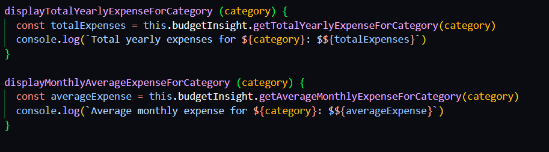
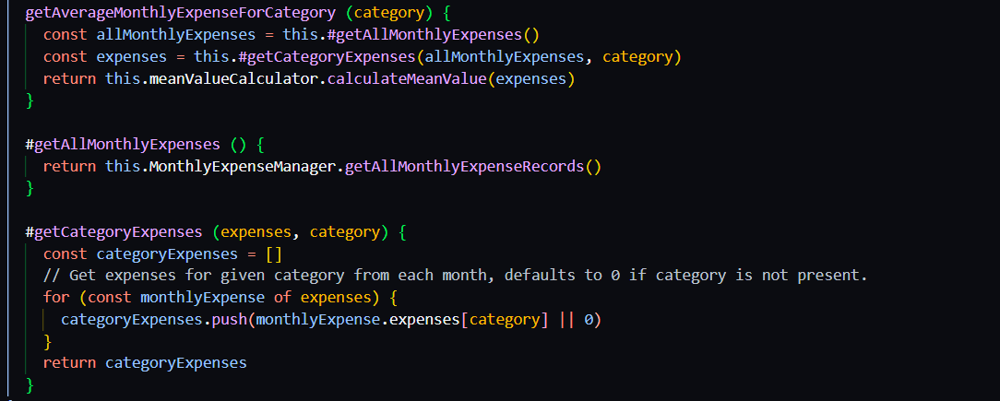

# Reflektion kring Clean Codes påverkan på appen och modulen

## Kap 2
Namngivning och de principer som boken tar upp kring området, är kanske det som påverkat min kod mest av allt. Min utgångspunkt har hela tiden varit att välja så beskrivande namn som möjligt. Vilket jag också nu inser hjälper en att både förstå koden och inte tvingas skriva överflödiga kommentarer. Ibland kan jag tycka att namnen blir onödigt långa och att jag möjligen bryter mot principer som "Don't Add Gratuitous Context" i mitt försök att skapa så beskrivande namn som möjligt. Detta kan dels bero på språkbrister men jag tror också min inställning beskrivande namn har högst prioritet påverkar detta.

 

 ## Kap 3
 "Do One Thing" som tas upp i kapitlet har influerat koden till stor del. Även om jag ser värdet i det gällande läsbarhet, förståelse och underhållbarhet med mera så tycker jag det är svårt att implementera och ibland gör koden mindre tydlig. Jag kan tycka att det kan vara bra att ha privata hjälpmetoder som gör en sak men som samlas som i en mittpunkt i en publik metod som sedan används. För mig är det ett strukturerat sätt som är lätt att förstå och klasserna blir inte lika långa som om exakt allt bryts ut till att göra en sak väldigt strikt. Jag vet inte riktigt hur synen på det här kopplat till clean code i allmänhet är. Huruvida en publik "uppsamlingsmetod" som använder flera privata hjälpfunktioner följer "Do One Thing" är förmodligen diskutabelt. En annan aspekt från kapitlet som jag haft funderingar kring tidigare och som jag ser som endast postiv är "The Stepdown Rule". Tidigare har det varit lite oklart hur man egentligen bör sortera kod, där privata eller för den delen publika hjälpmetoder förekommer. Nu har jag sorterat det så publik följs av de relevanta hjälpmetoderna vilket skapar struktur.

 Nedan följer bild som visar på en publik "samlingsmetod" som möjligen bryter mot "Do One Thing" och följer "The Stepdown Rule"

 